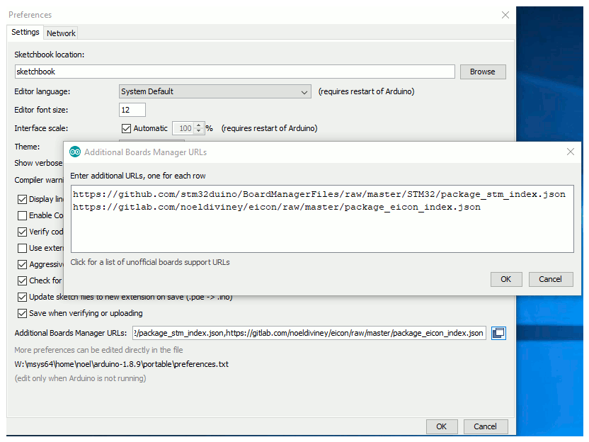
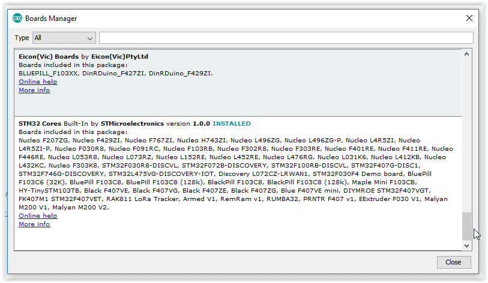
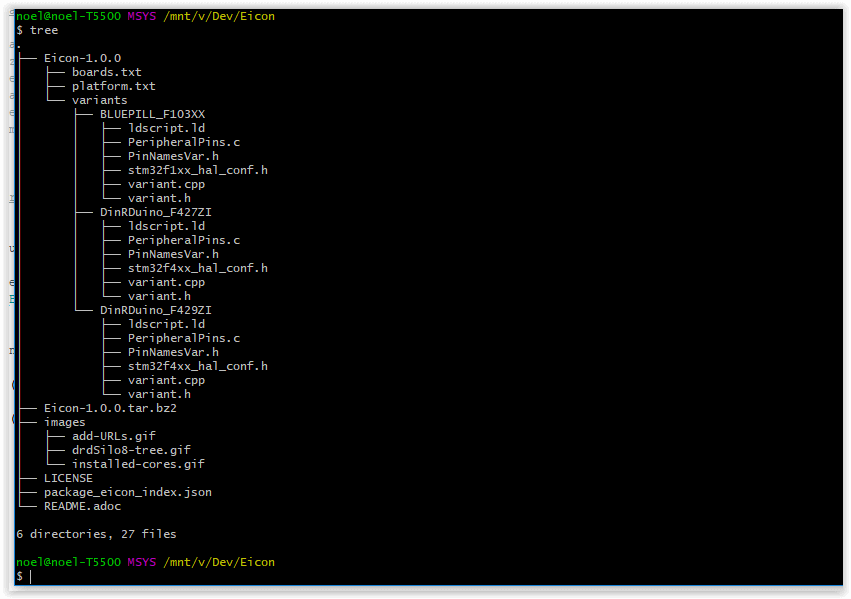

# Eicon-1.0.0

## Arduino core support for http://www.eicon-vic.com/["Eicon(Vic) Pty Ltd"] based boards using STM32

https://github.com/stm32duino/Arduino_Core_STM32/releases/latest[image:https://img.shields.io/github/release/stm32duino/Arduino_Core_STM32.svg[GitHub
release]]
https://github.com/stm32duino/Arduino_Core_STM32/compare/1.5.0...master[image:https://img.shields.io/github/commits-since/stm32duino/Arduino_Core_STM32/1.5.0.svg[GitHub
commits]]
https://travis-ci.com/stm32duino/Arduino_Core_STM32[image:https://travis-ci.com/stm32duino/Arduino_Core_STM32.svg?branch=master[Build
Status]]

* https://github.com/eiconDinRDuino/Eicon#Introduction[Introduction]
* https://github.com/stm32duino/Arduino_Core_STM32#getting-started[Creating the Eicon-1.0.0-tar.bz2 Tarball]
* https://github.com/stm32duino/Arduino_Core_STM32#boards-available[Boards available]
* https://github.com/stm32duino/Arduino_Core_STM32#troubleshooting[Troubleshooting]
* https://github.com/stm32duino/wiki/wiki/[Wiki]

# Introduction

This repo shows how to add Vendor (Eicon) boards using the Stm32 core to the Arduino IDE  +
My development environment is on Windows and is on a portable Drive which is set to Drive Letter W:   +
Arduino is installed to W:\msys64\home\noel\arduino-1.8.10  +
STM32 core is installed to W:\msys64\home\noel\arduino-1.8.10\portable\packages   +
See https://github.com/stm32duino/wiki/wiki/Getting-Started[Getting Started] for instructions on installing Arduino and STM32 cores  +

To facillitate using the Arduino Ide "Boards Manager" to do the installation two files are required  +
"package_eicon_index.json" and a tarball containing the Variants folder, boards.txt and platform.txt  +
See the https://github.com/stm32duino/wiki/wiki/Add-a-new-variant-(board)[Add a new Variant] and 
https://github.com/arduino/Arduino/wiki/Arduino-IDE-1.6.x-package_index.json-format-specification[package_eicon_index.json specification] for an explanation on what all of this is about

# Creating the Eicon-1.0.0-tar.bz2 Tarball

    Execute the following bash commands to create the tarball and 
    generate the sha256 CRC and the tarball size
    
    Launch Msys64 Stm32 terminal
    Terminal opens at  +
    noel@DESKTOP-0AFLL5T MSYS /mnt/w/msys64/home/noel/Dev  +
....
    $: git clone https://gitlab.com/noeldiviney/Eicon.git
    $: cd Eicon
....
    Make any changes required to Variants, boards.txt and platform.txt
....
    $: rm -rf Eicon-1.0.0.tar.bz2
    $: tar -cjvf Eicon-1.0.0.tar.bz2 Eicon-1.0.0/*
    $: sha256deep64.exe Eicon-1.0.0.tar.bz2
       113b20b8fbd88dd29df31538f9247b085fede4fc8c05478a4f75918f57a8efe0  W:\msys64\home\noel\Dev\eicon\Eicon-1.0.0.tar.bz
    $: size --target=binary Eicon-1.0.0.tar.bz2
          text    data     bss     dec     hex    filename
              0   30619      0     30619   779b   Eicon-1.0.0.tar.bz2
....

    Edit json file package_eicon_index.json
    Update lines 20,21,23 and 24 withthe above results as follows
....
    20	"url":              "https://gitlab.com/noeldiviney/eicon/raw/master/Eicon-1.0.0.tar.bz2",
    21  "archiveFileName":  "Eicon-1.0.0.tar.bz2",
    22  "checksum":         "SHA-256:113b20b8fbd88dd29df31538f9247b085fede4fc8c05478a4f75918f57a8efe0",
    23  "size":             "24240",
....

# Installing Eicon-1.0.0 into the Arduino Ide

Eicon-1.0.0 depends on the Stm32 installed core so for an explanation of what is involved  +
See the https://github.com/stm32duino/wiki/wiki/Getting-Started[Stm32duino Wiki] which explains setting up the Arduino Ide for installing Eicon-1.0.0 + 

## Adding the "package_eicon_index.json" to Arduino Ide Preferences
Launch Arduino Ide and go to File -> Preferences  +
Go to https://gitlab.com/noeldiviney/Eicon[gitlab]  +
and log in to the Eicon Project  + 
Click "package_eicon_index.json" and select "Open Raw" button (2nd button on the Right Hand side)  +
Right Click and select "Copy Link Location"  +
Paste this into "Additional Boards Manager URLs  +

Close Preferences by clicking "ok" and "ok"
Go to Tools -> board -> Boads Manager to launch the "Boards Manager" GUI  +
Scroll down to find 

## Adding Symbolic links to the dependent Stm32 Coree and Libraries 

### cores
We are using the STM32 core  +
This is enabled in boards.txt line 21 DinRDuinoF4_144.build.core=STM32:arduino

### libraries
Any local libraries can be put here

### system
Same as cores above    

### Variants File Structure

